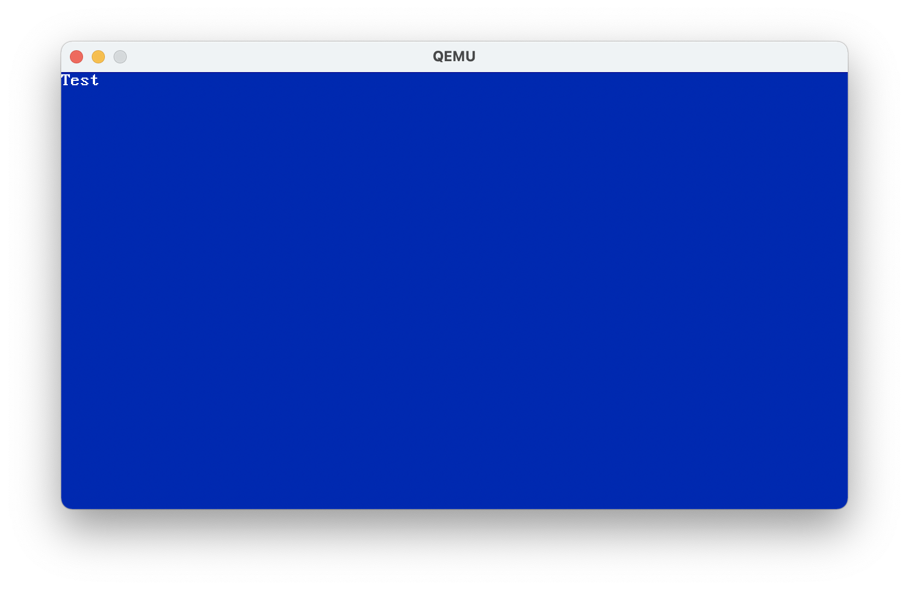

# Pro Multi-Stage Loader

<p align="center">
    
</p>
A 16-to-64-bit BIOS Bootstrapper.

## Initialization Process
1. Start from 16-bit BIOS
2. Load Second-Stage from Hard Disk, USB or Floppy
3. Implement Basic support for printing hexadecimal strings
4. Test the A20 Bus Line
5. Enable the A20 Bus Line
6. Check for Long Mode
7. Set up Paging and a Global Descriptor Table
8. Finally Switch to Long Mode Pre-initialization environment
9. **-> 64-bit code execution!**

*Also Includes a basic 64-bit VGA Driver.*

## Build
```bash
make main.bin; make run
```

## License
[MIT License](LICENSE)
